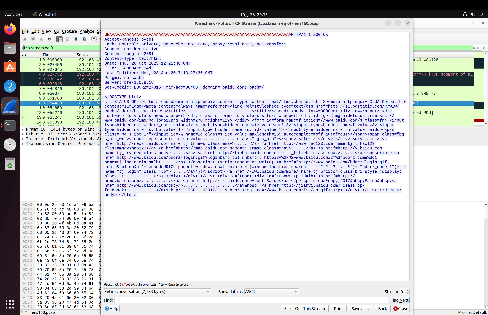

1. which servers you want to connect to?

```
$ ping www.baidu.com
PING www.a.shifen.com (180.101.50.188) 56(84) bytes of data.
...
```

2. what's your local public ethernet interface + ip?

```
$ ip addr
1: lo: <LOOPBACK,UP,LOWER_UP> mtu 65536 qdisc noqueue state UNKNOWN group default qlen 1000
    link/loopback 00:00:00:00:00:00 brd 00:00:00:00:00:00
    inet 127.0.0.1/8 scope host lo
       valid_lft forever preferred_lft forever
    inet6 ::1/128 scope host
       valid_lft forever preferred_lft forever
2: ens160: <BROADCAST,MULTICAST,UP,LOWER_UP> mtu 1500 qdisc fq_codel state UP group default qlen 1000
    link/ether 00:0c:29:83:1c:a4 brd ff:ff:ff:ff:ff:ff
    altname enp2s0
    inet 192.168.43.83/24 brd 192.168.43.255 scope global dynamic noprefixroute ens160
       valid_lft 2636sec preferred_lft 2636sec
    inet6 fe80::b254:7af9:54a7:f7e1/64 scope link noprefixroute
       valid_lft forever preferred_lft forever

```

3. start a terminal and run the obfuscator:
```
# ./target/debug/tun_obfuscator -l 1.1.0.0/16 -r 180.101.0.0/16 -i ens160 -p 192.168.43.83
2023-10-26T12:21:10.897437Z  INFO tun_obfuscator: creating tun...
2023-10-26T12:21:10.897660Z  INFO tun_obfuscator: tun created, name: obfuscator_tun
2023-10-26T12:21:10.897668Z  INFO tun_obfuscator: executing `sysctl -w net.ipv4.ip_forward=1`
net.ipv4.ip_forward = 1
2023-10-26T12:21:10.899440Z  INFO tun_obfuscator: executing `ip addr add 1.1.0.0/16 dev obfuscator_tun`
2023-10-26T12:21:10.900488Z  INFO tun_obfuscator: executing `iptables -t nat -D POSTROUTING -o obfuscator_tun -j MASQUERADE`
iptables: Bad rule (does a matching rule exist in that chain?).
2023-10-26T12:21:10.912266Z  INFO tun_obfuscator: executing `iptables -t nat -A POSTROUTING -o obfuscator_tun -j MASQUERADE`
2023-10-26T12:21:10.917233Z  INFO tun_obfuscator: executing `sudo iptables -t nat -D POSTROUTING -s 1.1.0.0/16 -o ens160 -j SNAT --to 192.168.43.83`
iptables: Bad rule (does a matching rule exist in that chain?).
2023-10-26T12:21:10.927210Z  INFO tun_obfuscator: executing `sudo iptables -t nat -A POSTROUTING -s 1.1.0.0/16 -o ens160 -j SNAT --to 192.168.43.83`
2023-10-26T12:21:10.935511Z  INFO tun_obfuscator: setup tun and iptables done.
2023-10-26T12:21:10.935528Z  INFO tun_obfuscator: running..
```

4. start a new terminal and access via mirror ip:
```
$ curl http://1.1.50.188 -v -H Host:www.baidu.com
*   Trying 1.1.50.188:80...
* Connected to 1.1.50.188 (1.1.50.188) port 80 (#0)
> GET / HTTP/1.1
> Host:www.baidu.com
> User-Agent: curl/7.81.0
> Accept: */*
> 
* Mark bundle as not supporting multiuse
< HTTP/1.1 200 OK
< Accept-Ranges: bytes
< Cache-Control: private, no-cache, no-store, proxy-revalidate, no-transform
< Connection: keep-alive
< Content-Length: 2381
< Content-Type: text/html
< Date: Thu, 26 Oct 2023 12:22:48 GMT
< Etag: "588604c8-94d"
< Last-Modified: Mon, 23 Jan 2017 13:27:36 GMT
< Pragma: no-cache
< Server: bfe/1.0.8.18
< Set-Cookie: BDORZ=27315; max-age=86400; domain=.baidu.com; path=/
< 
<!DOCTYPE html>
<!--STATUS OK--><html> <head><meta http-equiv=content-type content=text/html;charset=utf-8><meta http-equiv=X-UA-Compatible content=IE=Edge><meta content=always name=referrer><link rel=stylesheet type=text/css href=http://s1.bdstatic.com/r/www/cache/bdorz/baidu.min.css><title>百度一下，你就知道</title></head> <body link=#0000cc> <div id=wrapper> <div id=head> <div class=head_wrapper> <div class=s_form> <div class=s_form_wrapper> <div id=lg>  </div> <form id=form name=f action=//www.baidu.com/s class=fm> <input type=hidden name=bdorz_come value=1> <input type=hidden name=ie value=utf-8> <input type=hidden name=f value=8> <input type=hidden name=rsv_bp value=1> <input type=hidden name=rsv_idx value=1> <input type=hidden name=tn value=baidu><span class="bg s_ipt_wr"><input id=kw name=wd class=s_ipt value maxlength=255 autocomplete=off autofocus></span><span class="bg s_btn_wr"><input type=submit id=su value=百度一下 class="bg s_btn"></span> </form> </div> </div> <div id=u1> <a href=http://news.baidu.com name=tj_trnews class=mnav>新闻</a> <a href=http://www.hao123.com name=tj_trhao123 class=mnav>hao123</a> <a href=http://map.baidu.com name=tj_trmap class=mnav>地图</a> <a href=http://v.baidu.com name=tj_trvideo class=mnav>视频</a> <a href=http://tieba.baidu.com name=tj_trtieba class=mnav>贴吧</a> <noscript> <a href=http://www.baidu.com/bdorz/login.gif?login&amp;tpl=mn&amp;u=http%3A%2F%2Fwww.baidu.com%2f%3fbdorz_come%3d1 name=tj_login class=lb>登录</a> </noscript> <script>document.write('<a href="http://www.baidu.com/bdorz/login.gif?login&tpl=mn&u='+ encodeURIComponent(window.location.href+ (window.location.search === "" ? "?" : "&")+ "bdorz_come=1")+ '" name="tj_login" class="lb">登录</a>');</script> <a href=//www.baidu.com/more/ name=tj_briicon class=bri style="display: block;">更多产品</a> </div> </div> </div> <div id=ftCon> <div id=ftConw> <p id=lh> <a href=http://home.baidu.com>关于百度</a> <a href=http://ir.baidu.com>About Baidu</a> </p> <p id=cp>&copy;2017&nbsp;Baidu&nbsp;<a href=http://www.baidu.com/duty/>使用百度前必读</a>&nbsp; <a href=http://jianyi.baidu.com/ class=cp-feedback>意见反馈</a>&nbsp;京ICP证030173号&nbsp;  </p> </div> </div> </div> </body> </html>
* Connection #0 to host 1.1.50.188 left intact
```

5. let's check the tcp stream in wireshark

